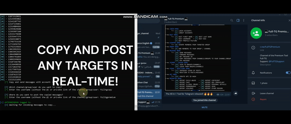
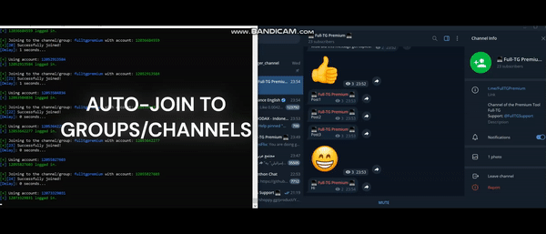

# 🚀 Telegram-Message-Sender-TG
Telegram Message Sender is a powerful automation solution for sending bulk direct messages to Telegram users. Designed for outreach, promotion, and communication at scale, it helps you connect with thousands of Telegram users instantly — directly into their inbox.

This tool is ideal for marketers, community managers, and businesses looking to engage their audience with personalized messages at scale.

## GET TOOL HERE: https://shorturl.at/yxWGr

Feel free to contact us for any questions: https://shorturl.at/ZJHUf

#### ✅ What is a Telegram Mass DM Tool?

A Telegram Message Sender Tool (Direct Messaging Tool) is software that automates the process of sending messages to multiple Telegram users individually. Instead of manually messaging users one by one, this tool sends direct messages automatically, saving you hours of time and effort.

Depending on how it’s configured, the tool can:
- Send messages to users from specific groups or channels
- Personalize each message using templates
- Support multiple accounts to increase reach
- Manage delays and limits to avoid account restrictions

#### 💡 Why Use a Telegram Bulk Messaging Tool?

Whether you're promoting a new service or building awareness for your community, sending DMs is one of the most direct and effective outreach methods on Telegram.
Here’s why Telegram mass messaging tools are valuable:

- **Instant User Engagement:** Reach users right in their private chats — no need for ads or posts.
- **High Visibility:** Telegram DMs are seen and opened more than group messages or broadcasts.
- **Customizable Messaging:** Use variables to personalize content, making your messages more engaging.
- **Scalable Outreach:** Send messages to hundreds or thousands of users automatically.
- **Cost-Effective Marketing:** No ad spend — just results through direct outreach.

#### 📈 Use Cases

This tool is useful for:
- **Product Launches:** Announce new features or services directly to interested users
- **Event Promotion:** Drive signups by messaging users with event details
- **Community Building:** Invite users to join your group, channel, or forum
- **Lead Follow-Up:** Reconnect with users from export lists or previous interactions
- **Affiliate Campaigns:** Deliver offers directly to users who are likely to convert

#### ⚙️ Features at a Glance

**The total functions of this tool:**

- SCRAPE MEMBERS, MESSAGES, MEDIA, CHANNELS AND MORE! (EVEN HIDDEN MEMBERS)

- ADD MEMBERS TO YOUR GROUPS/CHANNELS AUTOMATICALLY!
- FILTERING ONLY PREMIUM MEMBERS POSSIBLE! (OPTIONAL)

- AUTOMATICALLY FORWARD ANY POST/MESSAGE/MEDIA TO ANY TARGET!
- MASSDM ANYONE ON TELEGRAM!

- CLONE AND COPY ANY CHANNELS/GROUPS!

- JOIN TO TARGETS WITH ALL OF YOUR ACCOUNTS AUTOMATICALLY!

- GET RID OF YOUR COMPETITION EASILY!
- GROW YOUR AUDIENCE EASILY!
- GROW YOUR VIEWS AUTOMATICALLY!

- VOTE ON ANY POLLS AUTOMATICALLY!
- UNSPAM AND UNFREEZE YOUR ACCOUNTS EASILY!
- REACT TO ANY POST AUTOMATICALLY WITH EMOJI'S!
- MAKE BACKUPS!
- NO CODING SKILLS REQUIRED!
- PROXY SUPPORTED (OPTIONAL)
- THE ONLY TG TOOL WHICH IS UPDATED TO 2025!
- SUPPORT AND UPDATES FOR LIFETIME!
- **AND MUCH MORE!**
NEW FEATURES WILL BE IMPLEMENTED AT WISH!
If you have any questions, make sure to contact us.

## GET TOOL HERE: https://shorturl.at/yxWGr

Feel free to contact us for any questions: https://shorturl.at/ZJHUf

